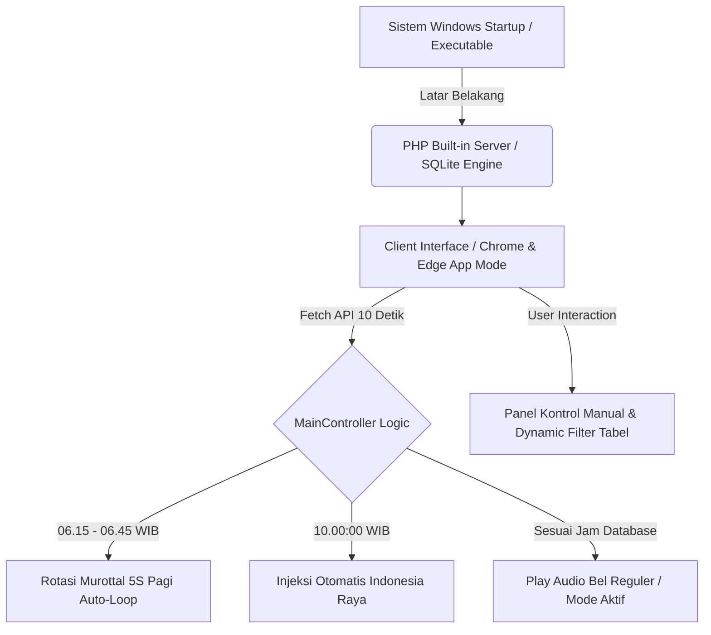

<div align="center">

  

  # 🔔 Bel Sekolah Otomatis — SPEMTO v1.0
  **Local Engine & Desktop Standalone Automation System**
  
  *Sistem Bel Sekolah Otomatis Berbasis Web Lokal & Standalone Desktop App untuk SMP Muhammadiyah Tonjong*

  [](https://laravel.com)
  [](https://php.net)
  [](https://tailwindcss.com)
  [](https://sqlite.org)
  [](https://jrsoftware.org/isinfo.php)
  [](LICENSE)

  [Fitur Utama](#-fitur-unggulan) • [Alur Sistem](#-arsitektur--alur-sistem) • [Instalasi](#-panduan-instalasi) • [Struktur File](#-struktur-direktori) • [Pengembangan](#-panduan-installer-inno-setup) • [Kontak](#-tim-pengembang--kontak)

</div>

---

## 📌 Tentang Project

**Bel Sekolah Otomatis SPEMTO v1.0** adalah sistem otomasi jadwal bel, pemutaran murottal 5S pagi, lagu kebangsaan, serta pengumuman TOA sekolah yang dirancang khusus untuk kebutuhan operasional **SMP Muhammadiyah Tonjong, Kabupaten Brebes**. 

Aplikasi ini menggabungkan fleksibilitas **Laravel Engine** dengan kemudahan penggunaan **Standalone Desktop App** (via Inno Setup & Browser App Mode). Sistem dapat berjalan secara *offline*, hemat daya, dan tidak memerlukan server internet luar.

---

## 🔥 Fitur Unggulan

| Emoji | Fitur Utama | Deskripsi Detail |
| :---: | :--- | :--- |
| 📅 | **Mode Bel Operasional** | Mendukung presetting jadwal harian: **Reguler (KBM biasa)**, **Bulan Puasa (Ramadhan)**, **ASTS (UTS)**, **ASAS (UAS)**, dan **Ujian Sekolah**. |
| 🕌 | **Kontrol Spesial Hari Jumat** | Pilihan toggle instan antara **Mode Jamaah** (Shalat Jumat di Sekolah, Pulang 13.00 WIB) dan **Mode Ringkas** (Air Minim / Pulang 11.00 WIB). |
| 📖 | **Murottal 5S Pagi Otomatis** | Berjalan otomatis pukul **06.15–06.45 WIB** (Senin–Sabtu). Menggunakan *Smart Random Shuffle* tanpa pengulangan lagu hingga semua playlist habis, serta aman dari *late-trigger* jika laptop dinyalakan pasca 06.45 WIB. |
| 🇮🇩 | **Lagu Indonesia Raya** | Pemutaran otomatis **Lagu Indonesia Raya** tepat pukul **10.00 WIB** setiap hari Senin–Sabtu tanpa perlu diinputkan manual. |
| ⚡ | **Panel Kontrol & Chime TOA** | Tombol pintas pemutaran langsung untuk Bel Masuk, Istirahat, Pulang, Indonesia Raya, serta **Chime Pembuka & Penutup** pengumuman mikrofon/TOA. |
| 📋 | **Tabel Management Interaktif** | Manajemen jadwal lengkap dengan **Logical Sorting** (Senin $\rightarrow$ Sabtu, Jam Terawal) serta **Interactive Dropdown Filter** per Hari & Varian Mode. |
| 🌙 | **Dual Theme Support** | Mendukung mode tampilan **Light Mode** dan **Dark Mode** dengan penyimpanan memori *localStorage*. |
| ⏱️ | **Keep-Alive & WakeLock System** | Dilengkapi teknologi Web Audio API Keep-Alive & Screen WakeLock untuk mencegah Windows / Browser mengalami *sleep/suspension* audio. |
| 📦 | **Clean Standalone Installer** | Dipaketkan dengan Inno Setup Installer (Auto-detect Chrome/Edge App Mode, auto-kill background process, dan **100% Clean Uninstall** tanpa sisa). |

---

## 🏗️ Arsitektur & Alur Sistem



---

## 🛠️ Tech Stack & Modul

* **Core Engine:** PHP 8.1+ & Laravel Framework 10.x
* **Database:** SQLite 3 (Ringan, Tanpa Konfigurasi Service MySQL)
* **Frontend UI:** TailwindCSS, HTML5 Web Audio API, Vanilla JavaScript ES6
* **Desktop Packaging:** Inno Setup Compiler 6.x & Windows VBSscript Background Runner

---

## 🚀 Panduan Instalasi

### Option A: Menggunakan Installer Standalone (Rekomendasi Operasional Sekolah)
1. Unduh berkas **`Setup_Bel_Sekolah_Otomatis_SPEMTO_v1.0.exe`** dari folder release/output installer.
2. Jalankan berkas `.exe` dan ikuti petunjuk pemasangan hingga selesai.
3. Centang opsi *"Jalankan Bel Sekolah Otomatis saat Windows Startup"*.
4. Aplikasi akan otomatis berjalan di latar belakang dan membukakan tampilan *App Mode* melalui Google Chrome atau Microsoft Edge.

### Option B: Instalasi Manual (Development Environment)

1. **Clone Repository**
   ```bash
   git clone https://github.com/smpmuhtonjong/bel-sekolah-otomatis-spemto.git
   cd bel-sekolah-otomatis-spemto
   ```

2. **Install Dependency PHP**
   ```bash
   composer install
   ```

3. **Konfigurasi Environment File**
   ```bash
   cp .env.example .env
   php artisan key:generate
   ```

4. **Setup Database SQLite**
   Pastikan file `database/database.sqlite` sudah ada, lalu jalankan migrasi:
   ```bash
   php artisan migrate --seed
   ```

5. **Link Storage File Sound**
   ```bash
   php artisan storage:link
   ```

6. **Jalankan Server Lokal**
   ```bash
   php artisan serve
   ```
   Akses dashboard melalui browser di: `http://127.0.0.1:8000`

---

## 📂 Struktur Direktori Utama

```text
BelSekolah/
├── app/
│   ├── Http/Controllers/
│   │   └── MainController.php    # Logika Otomasi 5S, Indonesia Raya & Filtering
│   └── Models/
│       ├── Schedule.php          # Eloquent Model Jadwal Bel
│       └── Setting.php           # Eloquent Model Pengaturan Mode Bel
├── database/
│   └── database.sqlite           # Local SQLite Database
├── resources/
│   └── views/
│       └── dashboard.blade.php   # Antarmuka Dashboard UI Utama + Filter Table
├── storage/
│   └── app/public/sounds/        # Folder Penyimpanan Berkas Audio MP3 Bel & Murottal
├── run_background.vbs            # Runner Latar Belakang Windows (Silent Exec)
├── setup_script.iss              # Configuration Script Inno Setup Installer
└── README.md                     # Dokumentasi Project
```

---

## ⚙️ Panduan Installer (Inno Setup)

Untuk mengompilasi ulang installer executable (`.exe`), pastikan aplikasi **Inno Setup Compiler** telah terpasang di sistem Windows Anda:

1. Buka berkas `setup_script.iss` di aplikasi Inno Setup Compiler.
2. Pastikan path project di `Source: "C:\project\BelSekolah\*"` telah sesuai dengan direktori di komputer Anda.
3. Klik tombol **Compile** (atau tekan `Ctrl + F9`).
4. File `.exe` siap pakai akan tercipta di folder `OutputInstaller/`.

---

## 📞 Tim Pengembang & Kontak

Sistem ini dikembangkan dan dikelola secara penuh oleh **Tim IT / Tim Kreatif SMP Muhammadiyah Tonjong**:

* 🏫 **Lembaga:** SMP Muhammadiyah Tonjong (SPEMTO)
* 📍 **Alamat:** Jl. Raya Tonjong, Kecamatan Tonjong, Kabupaten Brebes, Jawa Tengah
* ✉️ **Email Resmi:** [smpmuhitonjong@gmail.com](mailto:smpmuhitonjong@gmail.com)
* 📞 **WhatsApp / Telepon:** [085185033377](https://wa.me/6285185033377)
* 🌐 **Website Resmi:** [https://smpmuhtonjong.sch.id](https://smpmuhtonjong.sch.id)

---

<div align="center">

  **© 2026 Tim IT SMP Muhammadiyah Tonjong. All Rights Reserved.**  
  *Dedicated to Enhancing Educational Automation & Excellence.*

</div>